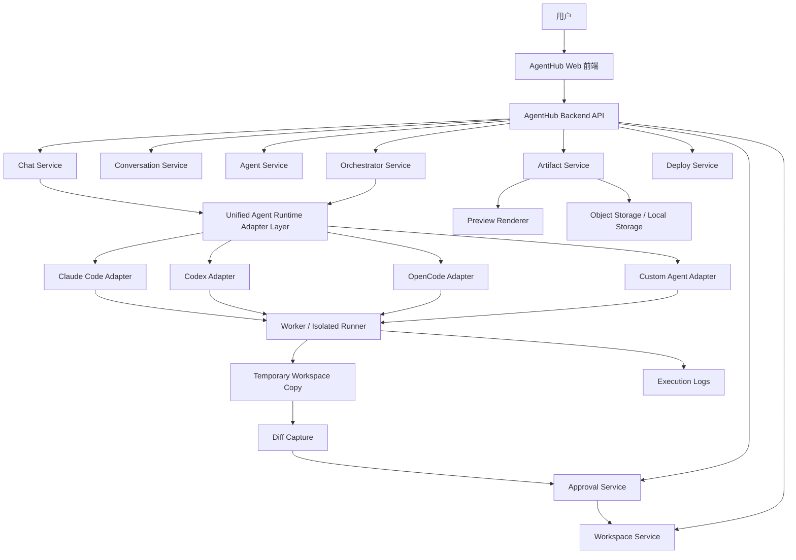
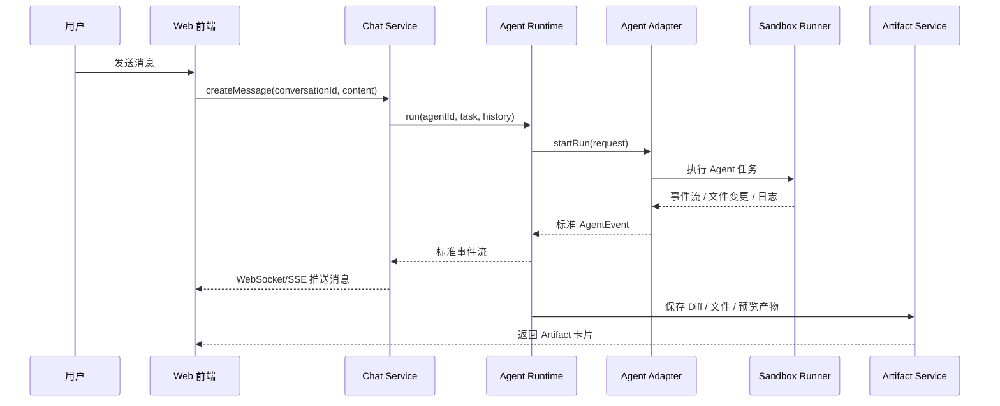
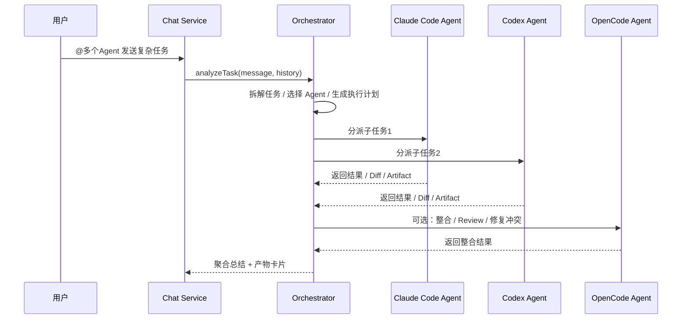

# AgentHub 技术架构设计

> 基于课题《AgentHub - 多 Agent 协作平台》整理。本文档面向可运行 Demo 与答辩交付，重点说明系统架构、IM 消息模型、Coding Agent Runtime Adapter、Orchestrator 调度、产物 Artifact 模型、审批安全边界、Runner 沙箱与 P0/P1/P2 开发计划。

详细技术分册见 `docs/technical-design/`：

- `01-architecture-overview.md`：总体架构、模块边界、关键设计决策。
- `02-core-flows.md`：消息、Orchestrator、CLI Runtime、审批、Artifact、部署核心流程。
- `03-runtime-security-and-data.md`：数据模型、Runner 安全边界、配置、风险和答辩索引。

---

## 1. 项目定位

AgentHub 是一个以 **IM 聊天** 为核心交互范式的多 Agent 协作平台。用户像使用飞书、微信一样，通过创建会话、发送消息、@ Agent 的方式，让不同 AI Agent 完成代码生成、网页生成、Workflow 生成、文档生成、产物预览和部署等任务。

平台核心目标：

1. 以聊天会话组织任务上下文。
2. 通过统一 Coding Agent Runtime Adapter 接入 Claude Code、Codex、OpenCode 等主流 Agent 平台。
3. 支持单 Agent 对话与多 Agent 群聊协作。
4. 支持 Orchestrator 自动拆解任务、分派 Agent、聚合结果。
5. 支持产物内联展示，包括代码块、Diff、文件、网页预览、部署状态等。
6. 支持用户自建 Agent，并配置 Prompt、工具集和能力标签。

本文档中的“Agent 平台接入”不是简单的大模型 Chat API 适配，而是把 Claude Code、Codex、OpenCode 这类具备仓库读取、工具调用、代码修改和命令执行能力的 Coding Agent 抽象成统一运行时。上层 IM 与 Orchestrator 只消费标准事件流；底层 Runner 在隔离 workspace 中执行任务，并把文件变更统一转换为 Diff Approval 和 Artifact。

---

## 2. 总体架构



### 2.1 核心模块

| 模块 | 职责 |
|---|---|
| Web 前端 | IM 会话列表、聊天窗口、Agent 联系人、Artifact 卡片、Diff 视图、预览面板 |
| Backend API | REST / WebSocket / SSE API，统一对外服务入口 |
| Chat Service | 消息收发、消息流式推送、消息状态管理 |
| Conversation Service | 会话创建、单聊/群聊、上下文管理、pin 消息 |
| Agent Service | Agent 注册、能力标签、系统 Prompt、工具集配置 |
| Orchestrator Service | 群聊任务拆解、Agent 分派、结果聚合、失败降级 |
| Runtime Adapter Layer | 屏蔽 Claude Code / Codex / OpenCode 差异，统一 Coding Agent 运行接口 |
| Workspace Service | 管理受控 workspace、ZIP 导入导出、文件树、文件读取、版本修订 |
| Artifact Service | 管理代码、Diff、网页、文件、部署状态等产物 |
| Approval Service | 所有文件写入、命令执行、部署发布都先生成审批，批准后才应用 |
| Local Runner | 在临时 workspace 副本中执行 Agent 任务并收集 diff |
| Deploy Service | 静态预览发布、本机 Node 项目预览、部署状态与日志 |

### 2.2 当前实现边界

当前实现采用受信任主机上的本机 Demo 交付形态：

- API 服务负责认证、IM、Agent、Artifact、Approval、Deployment、Workspace 等 REST/Socket 接口。
- 独立 Worker 进程负责 CLI Agent Runtime、白名单命令和本机 Node 项目预览。
- Web/PWA 复用同一前端，Electron 作为受控桌面壳，负责本地目录压缩导入、导出和系统通知。
- 首期数据库使用 SQLite；后续云端部署可迁移 PostgreSQL。
- CLI Agent 不直接修改正式 workspace，而是在临时副本中运行，执行后由平台计算 diff 并创建审批。

---

## 3. 核心业务流程

### 3.1 单聊模式流程



### 3.2 群聊协作流程



---

## 4. IM 聊天模型设计

AgentHub 的交互核心是 IM，因此数据模型应该围绕 Conversation、Message、Participant、Agent、Artifact 设计。

### 4.1 Conversation

```ts
export type ConversationType = "single" | "group";

export interface Conversation {
  id: string;
  type: ConversationType;
  title: string;
  ownerUserId: string;
  participantIds: string[];
  pinnedMessageIds: string[];
  archived: boolean;
  pinned: boolean;
  createdAt: string;
  updatedAt: string;
  lastMessageAt: string;
}
```

### 4.2 Message

```ts
export type MessageRole = "user" | "agent" | "orchestrator" | "system";

export type MessageContentType =
  | "text"
  | "code"
  | "image"
  | "file"
  | "diff"
  | "web_preview"
  | "deploy_status"
  | "agent_event";

export interface Message {
  id: string;
  conversationId: string;
  senderId: string;
  senderType: "user" | "agent" | "system";
  role: MessageRole;
  contentType: MessageContentType;
  content: unknown;
  artifactIds?: string[];
  replyToMessageId?: string;
  quotedMessageId?: string;
  status: "pending" | "streaming" | "completed" | "failed";
  createdAt: string;
  updatedAt: string;
}
```

### 4.3 Participant

```ts
export interface ConversationParticipant {
  conversationId: string;
  participantId: string;
  participantType: "user" | "agent";
  role: "owner" | "member" | "orchestrator";
  joinedAt: string;
}
```

---

## 5. Coding Agent Runtime Adapter Layer

### 5.1 设计目标

统一适配器层是本项目的关键技术模块。它需要屏蔽不同 Agent 平台的调用方式、输出格式、权限模型和产物格式差异。

设计目标：

1. 上层 Chat / Orchestrator 不直接依赖 Claude Code、Codex、OpenCode 的 SDK、CLI 或 HTTP API。
2. 所有 Agent 平台统一抽象为 Coding Agent Run，而不是简单 `chat(messages)`。
3. 所有执行过程统一转为 `AgentEvent` 事件流。
4. 所有产物统一转为 `Artifact`。
5. 支持取消、超时、失败重试、权限控制和审批阻塞。

### 5.2 核心接口

```ts
export type AgentProvider = "claude_code" | "codex" | "opencode" | "custom";

export type AgentMode = "chat" | "plan" | "review" | "patch" | "fix_ci" | "test" | "generate_web";

export interface PermissionProfile {
  name: "readonly" | "safe_write" | "autonomous";
  filesystem: "read_only" | "workspace_write";
  shell: "deny" | "allowlist" | "allow";
  network: "deny" | "allowlist" | "allow";
  requireApproval: boolean;
}

export interface AgentRunRequest {
  runId: string;
  conversationId: string;
  messageId: string;

  provider: AgentProvider;
  agentId: string;
  mode: AgentMode;
  task: string;

  history: AgentContextMessage[];

  workspace: {
    path: string;
    repoUrl?: string;
    branch?: string;
    commit?: string;
    readonly?: boolean;
  };

  permission: PermissionProfile;

  model?: string;

  limits?: {
    timeoutSec?: number;
    maxTurns?: number;
    maxOutputTokens?: number;
  };

  metadata?: Record<string, string>;
}

export interface AgentContextMessage {
  role: "user" | "assistant" | "system";
  content: string;
  pinned?: boolean;
  createdAt?: string;
}
```

### 5.3 统一事件模型

```ts
export type AgentEvent =
  | { type: "run_started"; runId: string; provider: AgentProvider; timestamp: string }
  | { type: "status"; runId: string; message: string; timestamp: string }
  | { type: "assistant_message"; runId: string; text: string; delta?: boolean; timestamp: string }
  | { type: "tool_call"; runId: string; name: string; input?: unknown; timestamp: string }
  | { type: "command_started"; runId: string; command: string; timestamp: string }
  | { type: "command_output"; runId: string; stream: "stdout" | "stderr"; text: string; timestamp: string }
  | { type: "file_changed"; runId: string; path: string; changeType: "created" | "modified" | "deleted"; timestamp: string }
  | { type: "artifact_created"; runId: string; artifact: Artifact; timestamp: string }
  | { type: "diff_created"; runId: string; diff: string; timestamp: string }
  | { type: "approval_requested"; runId: string; reason: string; action: unknown; timestamp: string }
  | { type: "usage"; runId: string; inputTokens?: number; outputTokens?: number; costUsd?: number; timestamp: string }
  | { type: "run_completed"; runId: string; summary: string; artifactIds?: string[]; timestamp: string }
  | { type: "run_failed"; runId: string; error: string; timestamp: string }
  | { type: "run_cancelled"; runId: string; reason?: string; timestamp: string };
```

### 5.4 Runtime 接口

```ts
export interface AgentRuntime {
  run(request: AgentRunRequest): AsyncIterable<AgentEvent>;
  cancel(runId: string): Promise<void>;
  getState(runId: string): Promise<AgentRunState>;
}

export interface AgentRunState {
  runId: string;
  status: "queued" | "running" | "waiting_approval" | "completed" | "failed" | "cancelled";
  startedAt?: string;
  completedAt?: string;
  error?: string;
}
```

### 5.5 Runtime Registry

```ts
export class AgentRuntimeRegistry {
  private runtimes = new Map<AgentProvider, AgentRuntime>();

  register(provider: AgentProvider, runtime: AgentRuntime) {
    this.runtimes.set(provider, runtime);
  }

  get(provider: AgentProvider): AgentRuntime {
    const runtime = this.runtimes.get(provider);
    if (!runtime) {
      throw new Error(`Unsupported agent provider: ${provider}`);
    }
    return runtime;
  }
}
```

### 5.6 与现有 Chat Runtime 的关系

当前代码中普通 LLM Agent 仍保留 `BaseAgent.streamChat()` 抽象，用于 OpenAI / Anthropic / MiMo 这类模型 Provider。外部 Claude Code / Codex / OpenCode 则进入 Coding Agent Runtime Adapter：

```text
LLM Agent
  -> streamChat(messages)
  -> 平台工具协议

Coding Agent Runtime
  -> startRun(task, workspace, permissions)
  -> AgentEvent stream
  -> diff / approval / artifact
```

因此系统存在两类 Agent：

| 类型 | 适用对象 | 工具来源 | 输出闭环 |
|---|---|---|---|
| LLM Agent | OpenAI / Anthropic / MiMo | AgentHub 平台工具 | 文本、Artifact、ToolApproval |
| Coding Agent Runtime | Claude Code / Codex / OpenCode | 外部 Agent 自带工具 + Runner | AgentEvent、Diff Approval、Artifact |

---

## 6. 平台适配器设计

### 6.1 Claude Code Adapter

#### 方案

P0 使用 Claude Code CLI headless 模式；P1 可切换或补充 Claude Agent SDK。这样既能快速跑通 Demo，又保留官方 SDK 深度集成空间。

```bash
claude --bare -p "$TASK" \
  --output-format stream-json \
  --max-turns 10
```

#### 职责

1. 根据 `AgentRunRequest` 生成 Claude Code 命令参数。
2. 将 `permission` 映射为 Claude Code 的权限策略。
3. 解析 stream-json 输出。
4. 归一化为 `AgentEvent`。
5. 在临时 workspace 副本中执行，捕获最终 diff 和文件变更。
6. 将文件变更交给 Approval Service，而不是直接写正式 workspace。

#### 示例代码

```ts
export class ClaudeCodeRuntime implements AgentRuntime {
  async *run(req: AgentRunRequest): AsyncIterable<AgentEvent> {
    yield nowEvent({ type: "run_started", runId: req.runId, provider: "claude_code" });

    const args = [
      "--bare",
      "-p",
      buildPrompt(req),
      "--output-format",
      "stream-json",
    ];

    if (req.limits?.maxTurns) {
      args.push("--max-turns", String(req.limits.maxTurns));
    }

    const proc = spawn("claude", args, {
      cwd: req.workspace.path,
      env: buildClaudeEnv(req),
    });

    for await (const line of readJsonLines(proc.stdout)) {
      yield normalizeClaudeEvent(line, req);
    }

    const exitCode = await waitExit(proc);
    if (exitCode !== 0) {
      yield nowEvent({ type: "run_failed", runId: req.runId, error: `Claude Code exited with ${exitCode}` });
      return;
    }

    const diff = await collectWorkspaceDiff(req.workspace.path);
    if (diff) {
      yield nowEvent({ type: "diff_created", runId: req.runId, diff });
    }

    yield nowEvent({ type: "run_completed", runId: req.runId, summary: "Claude Code run completed." });
  }

  async cancel(runId: string): Promise<void> {
    killProcessByRunId(runId);
  }

  async getState(runId: string): Promise<AgentRunState> {
    return getRunState(runId);
  }
}
```

---

### 6.2 Codex Adapter

#### 方案

P0 使用 Codex CLI 非交互模式。

```bash
codex exec \
  --cd "$WORKSPACE" \
  --json \
  --sandbox workspace-write \
  "$TASK"
```

#### 权限映射

```ts
function mapPermissionToCodexSandbox(permission: PermissionProfile) {
  switch (permission.name) {
    case "readonly":
      return "read-only";
    case "safe_write":
      return "workspace-write";
    case "autonomous":
      return "workspace-write";
    default:
      return "read-only";
  }
}
```

#### 示例代码

```ts
export class CodexRuntime implements AgentRuntime {
  async *run(req: AgentRunRequest): AsyncIterable<AgentEvent> {
    yield nowEvent({ type: "run_started", runId: req.runId, provider: "codex" });

    const args = [
      "exec",
      "--cd",
      req.workspace.path,
      "--json",
      "--sandbox",
      mapPermissionToCodexSandbox(req.permission),
    ];

    if (req.model) {
      args.push("--model", req.model);
    }

    args.push(buildPrompt(req));

    const proc = spawn("codex", args, {
      cwd: req.workspace.path,
      env: buildCodexEnv(req),
    });

    for await (const line of readJsonLines(proc.stdout)) {
      yield normalizeCodexEvent(line, req);
    }

    for await (const text of readLines(proc.stderr)) {
      yield nowEvent({ type: "status", runId: req.runId, message: text });
    }

    const exitCode = await waitExit(proc);
    if (exitCode !== 0) {
      yield nowEvent({ type: "run_failed", runId: req.runId, error: `Codex exited with ${exitCode}` });
      return;
    }

    const diff = await collectWorkspaceDiff(req.workspace.path);
    if (diff) {
      yield nowEvent({ type: "diff_created", runId: req.runId, diff });
    }

    yield nowEvent({ type: "run_completed", runId: req.runId, summary: "Codex run completed." });
  }

  async cancel(runId: string): Promise<void> {
    killProcessByRunId(runId);
  }

  async getState(runId: string): Promise<AgentRunState> {
    return getRunState(runId);
  }
}
```

---

### 6.3 OpenCode Adapter

#### 方案

P1 使用 `opencode serve` + `@opencode-ai/sdk`。

```bash
OPENCODE_SERVER_PASSWORD="$PASSWORD" \
opencode serve \
  --hostname 127.0.0.1 \
  --port 4096
```

#### 职责

1. 每个 Runner 启动一个短生命周期 OpenCode server。
2. 使用 SDK 创建 session。
3. 发送用户任务和上下文。
4. 监听事件流。
5. 归一化为 `AgentEvent`。
6. 收集文件变更和 diff。

#### 适用场景

OpenCode 更适合作为 HTTP 化的 Agent Runtime，因此适合在后续版本中接入 Web 平台、远程 Runner 和长生命周期 session。

### 6.4 Adapter 输出约束

无论底层是 CLI、SDK 还是 HTTP server，Adapter 都必须遵守以下约束：

1. 不向上层暴露平台私有事件结构，只输出 `AgentEvent`。
2. 不直接修改正式 workspace，只允许修改 Runner 中的临时副本。
3. 不直接创建 PR，不直接发布部署；这些动作交给 Workspace / SCM / Deploy Service。
4. 不把 API Key、CLI 登录态、完整环境变量写入日志或聊天消息。
5. 运行结束后必须产出：最终状态、日志摘要、文件变化列表；如有变更则创建 Diff Approval。

---

## 7. Orchestrator 设计

### 7.1 职责

Orchestrator 是群聊协作的主 Agent，负责：

1. 理解用户意图。
2. 判断是否需要多个 Agent 参与。
3. 拆解任务。
4. 选择合适的 Agent。
5. 决定串行或并行执行。
6. 处理失败和冲突。
7. 聚合结果并输出总结。

### 7.2 调度策略

```ts
export interface OrchestratorPlan {
  goal: string;
  steps: OrchestratorStep[];
}

export interface OrchestratorStep {
  id: string;
  agentId: string;
  provider: AgentProvider;
  task: string;
  dependsOn?: string[];
  mode: AgentMode;
  expectedArtifacts?: ArtifactType[];
}
```

### 7.3 示例执行计划

用户输入：

> 帮我做一个任务管理网页，前端用 React，要求支持新增、删除、筛选任务，并给出预览。

Orchestrator 生成计划：

```json
{
  "goal": "生成一个 React 任务管理网页并提供预览",
  "steps": [
    {
      "id": "step_1",
      "agentId": "claude_code_frontend",
      "provider": "claude_code",
      "task": "设计 React 组件结构和页面代码",
      "mode": "generate_web",
      "expectedArtifacts": ["code", "web_preview"]
    },
    {
      "id": "step_2",
      "agentId": "codex_reviewer",
      "provider": "codex",
      "task": "Review 生成代码并修复明显问题",
      "dependsOn": ["step_1"],
      "mode": "review",
      "expectedArtifacts": ["diff"]
    }
  ]
}
```

### 7.4 调度伪代码

```ts
export class OrchestratorService {
  constructor(private registry: AgentRuntimeRegistry) {}

  async runGroupTask(input: OrchestratorInput): Promise<void> {
    const plan = await this.createPlan(input);

    for (const step of topologicalSort(plan.steps)) {
      const runtime = this.registry.get(step.provider);

      const request = buildAgentRunRequest(input, step);

      for await (const event of runtime.run(request)) {
        await this.handleAgentEvent(input.conversationId, step, event);
      }
    }

    await this.createFinalSummary(input.conversationId, plan);
  }
}
```

---

## 8. Artifact 产物模型

AgentHub 的重要体验是“产物内联”，因此所有非纯文本输出都需要抽象为 Artifact。

### 8.1 Artifact 类型

```ts
export type ArtifactType =
  | "code"
  | "diff"
  | "file"
  | "image"
  | "web_preview"
  | "document"
  | "ppt"
  | "deploy_status"
  | "log";

export interface Artifact {
  id: string;
  conversationId: string;
  messageId?: string;
  runId?: string;
  type: ArtifactType;
  title: string;
  mimeType?: string;
  uri?: string;
  content?: string;
  metadata?: Record<string, unknown>;
  createdAt: string;
  updatedAt: string;
}
```

### 8.2 Artifact 卡片展示

| Artifact 类型 | 前端展示 |
|---|---|
| code | 代码块 + 复制 + 下载 |
| diff | Diff Viewer + 一键应用 |
| file | 文件卡片 + 下载 |
| image | 图片预览 |
| web_preview | iframe 预览 + 全屏打开 |
| document | Markdown / PDF / Doc 预览 |
| ppt | P2，PPT 浏览器 |
| deploy_status | 构建日志 + 预览 URL + 状态标签 |
| log | 可折叠日志面板 |

### 8.3 Diff Artifact

```ts
export interface DiffArtifactMetadata {
  baseCommit?: string;
  headCommit?: string;
  changedFiles: Array<{
    path: string;
    additions: number;
    deletions: number;
    status: "added" | "modified" | "deleted";
  }>;
  applyStatus?: "not_applied" | "applied" | "failed";
}
```

---

## 9. 上下文管理设计

### 9.1 上下文来源

Agent 每次运行时，上下文由以下部分组成：

1. 当前用户消息。
2. 最近 N 条聊天历史。
3. 用户 pin 的关键消息。
4. 当前会话中的相关 Artifact 摘要。
5. Agent 自身 System Prompt。
6. Orchestrator 生成的任务说明。

### 9.2 上下文组装

```ts
export interface ContextBuildOptions {
  conversationId: string;
  currentMessageId: string;
  agentId: string;
  maxMessages: number;
  includePinned: boolean;
  includeArtifacts: boolean;
}

export async function buildAgentContext(options: ContextBuildOptions): Promise<AgentContextMessage[]> {
  const systemPrompt = await getAgentSystemPrompt(options.agentId);
  const pinned = options.includePinned ? await getPinnedMessages(options.conversationId) : [];
  const recent = await getRecentMessages(options.conversationId, options.maxMessages);
  const artifacts = options.includeArtifacts ? await summarizeArtifacts(options.conversationId) : [];

  return [
    { role: "system", content: systemPrompt },
    ...pinned.map(toContextMessage),
    ...recent.map(toContextMessage),
    ...artifacts.map(toContextMessage),
  ];
}
```

---

## 10. 权限与沙箱设计

### 10.1 权限档位

| 档位 | 文件权限 | Shell 权限 | 网络权限 | 适用场景 |
|---|---|---|---|---|
| readonly | 只读 | 禁止或仅允许安全命令 | 禁止 | 代码 Review、方案分析 |
| safe_write | 工作区可写 | allowlist | 可选 allowlist | 代码生成、修复测试 |
| autonomous | 工作区可写 | 允许 | 可选允许 | Demo 自动化，但必须隔离运行 |

### 10.2 本机 Runner 边界

P0 使用受信任主机上的本机 Runner：

```text
每个 Agent Run 从正式 workspace 复制出独立临时 workspace
CLI 仅在临时 workspace 中执行
子进程注入最小必要环境变量
执行结束后收集 diff、日志、产物
文件变更转 ToolApproval，批准后才写回正式 workspace
本机模式不是操作系统级沙箱，不用于公网多租户部署
```

Runner 的安全边界：

1. API 服务不直接运行外部 CLI。
2. Worker 是唯一执行本机 CLI 的服务。
3. CLI 只操作临时 workspace，不直接操作用户原目录。
4. 生产环境必须替换为更强隔离的远程 runner、Kubernetes Job 或 Firecracker。
5. 所有写文件、跑命令、部署动作都必须经过审批或配置化权限档位。

### 10.3 命令 allowlist

```ts
const SAFE_COMMAND_ALLOWLIST = [
  "npm test",
  "npm run test",
  "npm run build",
  "pnpm test",
  "pnpm build",
  "pytest",
  "cargo test",
  "go test",
  "git diff",
  "git status",
];
```

---

## 11. 后端 API 设计

### 11.1 Conversation API

```http
POST   /api/conversations
GET    /api/conversations
GET    /api/conversations/:id
PATCH  /api/conversations/:id
POST   /api/conversations/:id/archive
POST   /api/conversations/:id/pin
```

### 11.2 Message API

```http
POST   /api/conversations/:id/messages
GET    /api/conversations/:id/messages
POST   /api/messages/:id/regenerate
POST   /api/messages/:id/reply
POST   /api/messages/:id/pin
```

### 11.3 Agent API

```http
POST   /api/agents
GET    /api/agents
GET    /api/agents/:id
PATCH  /api/agents/:id
DELETE /api/agents/:id
```

### 11.4 Runtime API

```http
POST   /api/agent-runs
GET    /api/agent-runs/:runId
GET    /api/agent-runs/:runId/events
POST   /api/agent-runs/:runId/cancel
POST   /api/agent-runs/:runId/approve
```

当前 Demo 实现中，Agent Run 先内嵌在 Chat Socket 链路中：

```text
Client message:send
  -> Chat Service 创建用户消息
  -> AgentRuntime/CliRun 入队
  -> Worker 执行并写入事件/日志
  -> Socket message:chunk / message:completed 推送
  -> ToolApproval 负责 Diff 应用
```

`/api/agent-runs/*` 作为 P1 网关 API 抽取目标，用于后续对接 Slack、飞书、GitHub、CI 和其他外部平台。

### 11.5 Artifact API

```http
GET    /api/artifacts/:id
GET    /api/conversations/:id/artifacts
POST   /api/artifacts/:id/apply-diff
POST   /api/artifacts/:id/preview
```

---

## 12. 前端设计

### 12.1 页面结构

```text
AgentHub Web
├── 左侧 Sidebar
│   ├── 会话列表
│   ├── 新建对话按钮
│   ├── 搜索框
│   └── Agent 联系人入口
│
├── 中间 Chat Panel
│   ├── 会话标题栏
│   ├── 消息流
│   ├── Artifact 内联卡片
│   └── 输入框 / @Agent / 附件上传
│
└── 右侧 Preview Panel
    ├── Artifact 详情
    ├── Diff Viewer
    ├── Code Editor
    ├── Web iframe 预览
    └── 部署状态 P2
```

### 12.2 前端组件

| 组件 | 职责 |
|---|---|
| ConversationList | 会话列表、置顶、归档、搜索 |
| ChatWindow | 消息流展示 |
| MessageBubble | 文本、Agent 回复、用户消息 |
| AgentMentionInput | 输入框、@ Agent、附件上传 |
| ArtifactCard | 产物卡片统一入口 |
| DiffViewer | 展示代码 diff |
| WebPreview | iframe 网页预览 |
| CodeEditor | Monaco 编辑器 |
| AgentContactCard | Agent 联系人卡片 |
| OrchestratorTrace | 展示群聊任务拆解和执行过程 |

### 12.3 消息流推送

P0 当前使用 Socket.io 承载聊天消息和 Agent 运行事件；P1 可为 Agent Gateway 增加 SSE，方便第三方平台订阅 run event。

```ts
socket.on("message:chunk", appendChunk);
socket.on("task:state", updateTaskPanel);
socket.on("tool:approval-created", showApprovalNotice);
```

P1 Agent Gateway SSE 示例：

```ts
const eventSource = new EventSource(`/api/agent-runs/${runId}/events`);

eventSource.onmessage = (event) => {
  const agentEvent = JSON.parse(event.data);
  appendAgentEventToChat(agentEvent);
};
```

---

## 13. 数据库设计

本地 Demo 使用 SQLite 持久化 volume，降低验收和启动成本；公网或团队部署建议迁移 PostgreSQL。当前实现使用 Prisma，核心实体包括：

- User / ProviderConfig / CliRuntimeConfig
- Agent / Conversation / ConversationMember / Message
- Workspace / WorkspaceFileRevision
- Artifact / ArtifactVersion
- ToolApproval
- Deployment / DeploymentLog
- OrchestrationRun / OrchestrationTask
- CliRun

### 13.1 表结构

下方是概念表结构，真实字段以 Prisma schema 为准。

```sql
CREATE TABLE conversations (
  id TEXT PRIMARY KEY,
  type TEXT NOT NULL,
  title TEXT NOT NULL,
  owner_user_id TEXT NOT NULL,
  archived BOOLEAN DEFAULT FALSE,
  pinned BOOLEAN DEFAULT FALSE,
  created_at TIMESTAMP NOT NULL,
  updated_at TIMESTAMP NOT NULL,
  last_message_at TIMESTAMP
);

CREATE TABLE conversation_participants (
  conversation_id TEXT NOT NULL,
  participant_id TEXT NOT NULL,
  participant_type TEXT NOT NULL,
  role TEXT NOT NULL,
  joined_at TIMESTAMP NOT NULL,
  PRIMARY KEY (conversation_id, participant_id)
);

CREATE TABLE messages (
  id TEXT PRIMARY KEY,
  conversation_id TEXT NOT NULL,
  sender_id TEXT NOT NULL,
  sender_type TEXT NOT NULL,
  role TEXT NOT NULL,
  content_type TEXT NOT NULL,
  content_json JSONB NOT NULL,
  status TEXT NOT NULL,
  reply_to_message_id TEXT,
  quoted_message_id TEXT,
  created_at TIMESTAMP NOT NULL,
  updated_at TIMESTAMP NOT NULL
);

CREATE TABLE agents (
  id TEXT PRIMARY KEY,
  provider TEXT NOT NULL,
  name TEXT NOT NULL,
  avatar_url TEXT,
  description TEXT,
  system_prompt TEXT,
  capability_tags JSONB,
  tool_config JSONB,
  created_by TEXT,
  created_at TIMESTAMP NOT NULL,
  updated_at TIMESTAMP NOT NULL
);

CREATE TABLE agent_runs (
  id TEXT PRIMARY KEY,
  conversation_id TEXT NOT NULL,
  message_id TEXT NOT NULL,
  agent_id TEXT NOT NULL,
  provider TEXT NOT NULL,
  status TEXT NOT NULL,
  request_json JSONB NOT NULL,
  summary TEXT,
  error TEXT,
  started_at TIMESTAMP,
  completed_at TIMESTAMP,
  created_at TIMESTAMP NOT NULL
);

CREATE TABLE artifacts (
  id TEXT PRIMARY KEY,
  conversation_id TEXT NOT NULL,
  message_id TEXT,
  run_id TEXT,
  type TEXT NOT NULL,
  title TEXT NOT NULL,
  mime_type TEXT,
  uri TEXT,
  content TEXT,
  metadata_json JSONB,
  created_at TIMESTAMP NOT NULL,
  updated_at TIMESTAMP NOT NULL
);
```

---

## 14. 推荐技术栈

### 14.1 前端

| 技术 | 用途 |
|---|---|
| React / Vite | Web/PWA 应用框架 |
| TypeScript | 类型安全 |
| Ant Design | 基础组件与管理界面 |
| Monaco Editor | 代码编辑器 |
| react-diff-viewer / Monaco Diff | Diff 展示 |
| Socket.io / SSE | 聊天消息流与 Agent Run 事件 |

### 14.2 后端

| 技术 | 用途 |
|---|---|
| Node.js / Express | 后端服务 |
| TypeScript | 与前端共享类型 |
| SQLite / PostgreSQL | 本地 Demo / 未来云端数据存储 |
| Prisma | ORM 与迁移 |
| 本机 Worker | 受信任主机上的 Demo Runner |
| BullMQ / Redis | P1 任务队列 |
| S3 / 本地文件系统 | Artifact 存储 |

### 14.3 Agent Runtime

| 平台 | P0 接入方式 | P1 接入方式 |
|---|---|---|
| Claude Code | CLI headless + stream-json | Claude Agent SDK |
| Codex | `codex exec` | Codex SDK / MCP server |
| OpenCode | 暂缓 | `opencode serve` + SDK |
| Custom Agent | OpenAI-compatible API | MCP tools / 自定义工具集 |

---

## 15. P0 / P1 / P2 开发计划

### P0：可运行 Demo

目标：完成核心链路，能展示 IM 聊天、Claude Code/Codex 接入、基础 Artifact、Diff 审批和本机进程运行。

| 模块 | 功能 |
|---|---|
| IM 基础 | 会话列表、单聊/群聊、消息流、输入框、引用、pin、重新生成 |
| Agent 接入 | OpenAI/Anthropic/MiMo LLM Provider + Claude Code/Codex Coding Agent Runtime |
| Runtime | `AgentRunRequest -> AgentEvent` 统一接口、事件归一化、CliRun 持久化 |
| Orchestrator 简版 | @ Agent 指定、基础任务拆解、顺序/并行执行、聚合总结 |
| Artifact | Web/Code/Document/Slides/Attachment、版本历史、Diff 卡片 |
| Runner | 本机 Worker、临时 workspace 副本、diff capture、审批后应用 |
| Demo 场景 | “导入 workspace → Claude Code 生成 → Codex Review → Diff 审批 → 预览/部署” |

P0 验收标准：

1. 用户能新建会话。
2. 用户能选择 Claude Code 或 Codex 作为聊天对象。
3. 用户发送任务后，后端能调用对应 Adapter。
4. Agent 回复能流式显示在聊天窗口。
5. 若产生文件修改，系统创建 Diff Approval，批准后正式 workspace 才变化。
6. 群聊中能 @ 两个 Agent，Orchestrator 能顺序调用并汇总。
7. CLI runtime 的 executable path、权限档位、可选独立 API Key 可在控制台配置和测试。

### P1：完整产品体验

| 模块 | 功能 |
|---|---|
| Agent Gateway | 抽出 `/api/agent-runs/*`、SSE event stream、第三方平台可调用 |
| 群聊 | Orchestrator 自动拆解任务、审批阻塞恢复、失败重试 |
| OpenCode | `opencode serve` + SDK 接入 OpenCode Adapter |
| 上下文 | pin 消息、Artifact 摘要进入上下文 |
| Artifact | 更完整网页 iframe 预览、Monaco 编辑器、Slides 图片/排序/播放 |
| 权限 | readonly / safe_write / autonomous |
| 任务队列 | 支持异步任务、真实取消、重试、运行日志持久化 |
| SCM | Git branch / commit / PR 生成 |

### P2：增强能力

| 模块 | 功能 |
|---|---|
| 部署 | 生产级预览代理、资源隔离、健康检查、日志流 |
| 多端 | 桌面端任务/容器管理、移动端专用审批与部署日志 |
| 版本历史 | Artifact 版本对比、回滚、导出增强 |
| 自建 Agent | 对话式创建 Agent、Prompt、工具集、runtime 模板 |
| 协作规范 | AI 协作 Spec、rules、skill 沉淀 |
| Demo 视频 | 3 分钟完整演示脚本 |

---

## 16. Demo 场景设计

### 场景：多 Agent 协作生成任务管理网页

#### 用户输入

```text
@Orchestrator 帮我做一个 React 任务管理网页，要求：
1. 支持新增任务
2. 支持删除任务
3. 支持按完成状态筛选
4. 页面要好看
5. 最后给我网页预览和代码 Diff
```

#### 执行过程

1. Orchestrator 拆解任务。
2. Claude Code Agent 生成 React 页面。
3. Codex Agent Review 并修复问题。
4. Artifact Service 生成 Diff 卡片。
5. Preview Service 启动本地预览。
6. Orchestrator 总结最终结果。

#### 最终聊天流

```text
用户：@Orchestrator 帮我做一个 React 任务管理网页...

Orchestrator：我会将任务拆成 3 步：页面生成、代码检查、预览生成。

Claude Code：已生成 TaskManager 组件和样式文件。
[代码 Artifact 卡片]

Codex：我检查了代码，修复了筛选逻辑中的状态更新问题。
[Diff Artifact 卡片]

Orchestrator：任务完成。你可以在下方预览网页。
[Web Preview 卡片]
```

---

## 17. 考察要点实现映射

本节用于把产品设计文档中的评分维度映射到当前工程实现，答辩时可以按 “需求 → 架构 → 代码入口 → 验证方式” 说明。

### 17.1 AI 协作能力：Spec / Rules / Skill 沉淀

|要求|工程体现|代码 / 文档入口|
|---|---|---|
|需求 Spec|产品文档定义 IM、多 Agent、产物、审批和多端范围|`AgentHub- 多Agent协作平台设计.md`|
|技术 Spec|技术文档定义服务边界、数据模型、Runtime、审批和部署链路|`AgentHub-技术架构设计.md`|
|协作 Rules|记录 AI 编码边界、Runner 安全规则、验收规则|`docs/ai-collaboration-record.md`|
|可复用 Prompt|沉淀 Coding Agent、Review Agent、Orchestrator 模板|`docs/ai-collaboration-record.md`|
|验收清单|按功能链路记录已完成项和剩余风险|`docs/acceptance-checklist.md`|

AI 协作不是只用 AI 写代码，而是把需求拆成可验收切片，并把规则沉淀成后续 Agent 可以复用的上下文。

### 17.2 功能完整度：IM 与多 Agent 调度

|能力|实现说明|核心入口|
|---|---|---|
|会话与消息|Socket 处理消息发送、流式更新、失败回写和 Agent 回复|`backend/src/sockets/index.ts`|
|上下文构建|按 token 预算拼接历史消息、pin 消息和 workspace 信息|`backend/src/services/ContextService.ts`|
|模型 Agent|通过 Provider 配置和 Agent adapter 调用 OpenAI 兼容接口|`backend/src/services/AgentRuntime.ts`|
|CLI Agent|通过本机 executable path 启动 Claude Code / Codex / OpenCode|`backend/src/services/agents/CliAgent.ts`|
|群聊调度|Orchestrator 创建 run / task，按 Agent 能力分派并聚合状态|`backend/src/services/Orchestrator.ts`|
|前端 IM|会话列表、消息流、@Agent、输入框、工作台和控制中心|`frontend/src/pages/ChatPage.tsx`|

P0 验收链路是：

```text
用户消息
  → Socket message:send
  → ContextService 构建上下文
  → AgentRuntime / CliAgent 执行
  → 消息流式回写
  → Diff / Artifact / Approval 卡片进入聊天流
```

### 17.3 生成效果质量：UI、Artifact 与工作台

|体验点|实现说明|核心入口|
|---|---|---|
|聊天 UI|桌面端聊天主区保持可读宽度，工作台默认按需打开|`frontend/src/index.css`, `frontend/src/pages/ChatPage.tsx`|
|@Agent 提示|全局 Agent 列表参与提示，当前会话成员置顶|`frontend/src/components/MessageInput.tsx`|
|Agent 配置|内置 Agent 只读，自建 Agent 可配置 Provider、模型、Prompt 和工具|`frontend/src/components/AgentContactList.tsx`|
|代码工作台|Workspace 文件树、文件读取、Monaco 编辑、手工修改审批|`frontend/src/components/WorkspaceWorkbench.tsx`|
|Artifact 预览|Web iframe、Markdown、Slides、Code / Attachment 只读预览|`frontend/src/components/ArtifactEditorModal.tsx`|
|控制中心|Provider、CLI Runtime、Workspace、Artifact、Approval、Deployment、Run 管理|`frontend/src/components/ControlCenterModal.tsx`|

生成质量的重点不是单个页面好看，而是 “Agent 产物可以被看见、编辑、审批、下载和部署”。

### 17.4 代码理解度：核心链路说明

答辩时建议按以下顺序解释核心逻辑：

1. **为什么用 IM**：IM 会话天然承载上下文、参与者、消息顺序和多轮协作。
2. **为什么抽 Agent Adapter**：模型 Agent、Claude Code、Codex、OpenCode 的调用方式不同，但平台只关心统一事件和最终产物。
3. **为什么用临时 workspace**：本机 Demo 不能直接让 CLI 修改正式目录，临时副本 + Diff 审批让风险可见。
4. **为什么审批是核心模型**：文件写入、命令执行、部署启动都可以统一成 `ToolApproval`。
5. **为什么 Artifact 独立建模**：聊天消息是过程，Artifact 是可版本化、可下载、可预览的交付物。

### 17.5 创新与产品感：超出普通 Chatbot 的部分

- **Agent 即联系人**：用户不需要选择复杂后端服务，只需要在聊天里选择或 @ 一个 Agent。
- **群聊式协作**：Orchestrator 把复杂任务拆成多个 Agent 子任务，过程在聊天流中可追踪。
- **安全可审查写入**：CLI Agent 可以真实操作代码，但正式 workspace 只接受审批后的 Diff。
- **产物内联**：Diff、网页预览、文档、部署状态作为卡片进入聊天流，不需要跳出当前工作上下文。
- **本机 Runner Demo**：复用用户已登录的 Claude Code CLI，降低演示部署门槛，同时明确不是生产沙箱。

---

## 18. 风险与应对

| 风险 | 应对 |
|---|---|
| 不同 Agent 输出格式差异大 | 强制通过 Adapter 转成 AgentEvent |
| Agent 运行时间长 | 加 timeout、任务队列、取消机制 |
| 文件修改不可控 | Runner 沙箱、权限档位、Diff 审核 |
| CLI 运行环境不一致 | 配置本机 executable path，运行前做 runtime test |
| 本机 Runner 隔离不足 | 仅用于可信本地 Demo，生产改为远程 Runner / Kubernetes Job / Firecracker |
| workspace 与会话未绑定 | Workspace Service 提供会话绑定能力，CLI Agent 无 workspace 时明确报错 |
| 群聊调度复杂 | P0 先做规则分派，P1 再做智能规划 |
| 预览环境不稳定 | P0 先支持静态 HTML/React 构建预览 |
| 成本不可控 | 限制 maxTurns、任务次数、模型选择 |
| 答辩解释困难 | 保持架构清晰：IM → Orchestrator → Runtime Adapter → Artifact |

---

## 19. 答辩讲解重点

### 19.1 一句话介绍

AgentHub 是一个以 IM 聊天为核心交互方式的多 Agent 协作平台，用户可以像拉群聊天一样让 Claude Code、Codex、OpenCode 等 Agent 分工协作生成代码、网页和文档产物。

### 19.2 技术亮点

1. **统一 Coding Agent Runtime Adapter**：屏蔽 Claude Code、Codex、OpenCode 的调用、事件和权限差异。
2. **事件流驱动 IM 体验**：Agent 执行过程实时转成聊天消息。
3. **Orchestrator 群聊调度**：复杂任务自动拆解并分派给多个 Agent。
4. **Artifact 内联产物**：代码、Diff、网页预览都能在聊天流中展示。
5. **Runner 沙箱 + 审批隔离**：Agent 只修改临时 workspace，正式 workspace 只接受用户批准后的 Diff。

### 19.3 推荐答辩架构图

```text
IM Chat UI
   ↓
Chat / Conversation Service
   ↓
Orchestrator
   ↓
Unified Agent Runtime Adapter
   ↓
Claude Code / Codex / OpenCode
   ↓
Worker / Sandbox Temporary Workspace
   ↓
Diff Approval
   ↓
Artifact: Text / Code / Diff / Preview / Deploy
```

---

## 20. 结论

AgentHub 的关键不是简单调用多个大模型，而是把多个 Coding Agent 抽象成统一的运行时，并用 IM 消息流承载它们的协作过程。

因此，项目实现应优先围绕以下主线推进：

```text
IM 会话体验
  → Agent Runtime Adapter
  → Orchestrator 调度
  → Runner 安全执行
  → Diff Approval
  → Artifact 内联预览
```

P0 阶段只要能跑通：

```text
用户发消息 → Orchestrator/Agent 接收 → Claude Code/Codex 执行 → 返回消息和 Diff → 聊天流展示
```

就已经能满足课题中“IM 核心体验、多 Agent 接入、群聊协作、产物内联”的主要要求，并具备较好的答辩展示效果。
